# Water Pot
[](https://github.com/vuejs/vue)
[](https://github.com/vuejs/vue)
[](https://github.com/vuejs/vue)

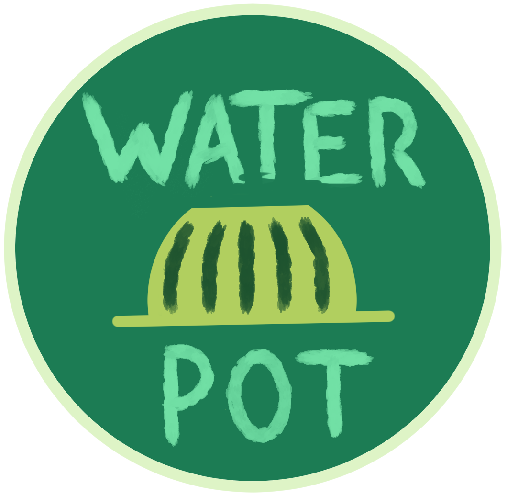

## ¿Qué es esto?
Sitio web que permitirá adquirir el dispositivo para ahorrar agua en cosechas, además de incorporar un llamado a la acción.


[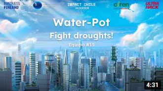](https://youtu.be/or1wAbNHC1E)

## ¿Qué paleta se utilizó?
La paleta está hecha con distintos tonos de verde.

[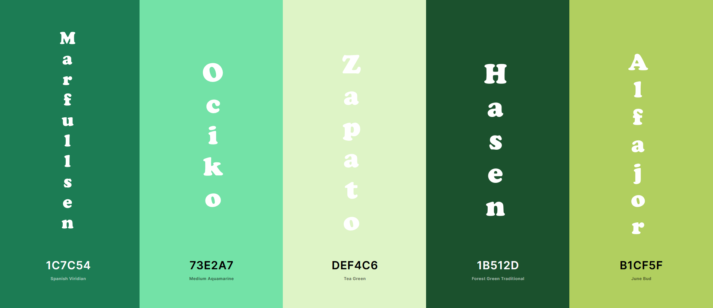](https://coolors.co/)

## Instalación del proyecto.
Comando para instalar todos los paquetes necesarios para iniciar el desarrollo.
```
npm install
```

### Compilación y recargas rápidas para el desarrollo.
Comando para levantar un sevidor local.
```
npm run serve
```

### Complilado y minificado para producción.
Comando para crear la versión definitiva y optimizada del sitio.
```
npm run build
```

### Lints y soluciones a problemas con archivos.
Comando para solucionar problemillas con archivos corruptos.
```
npm run lint
```

### Personalizar la configuración.
ir a [referencia de configuración](https://cli.vuejs.org/config/) para saber más de VueJs.

## Sobre los miembros del equipo

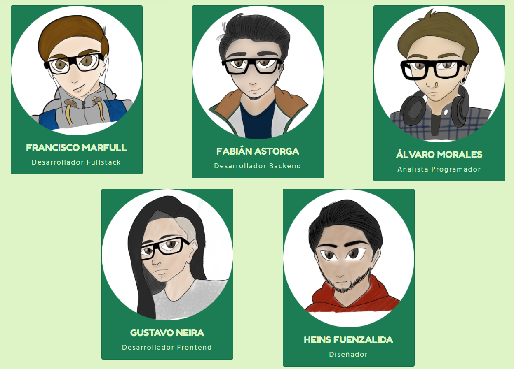

### Marfullsen

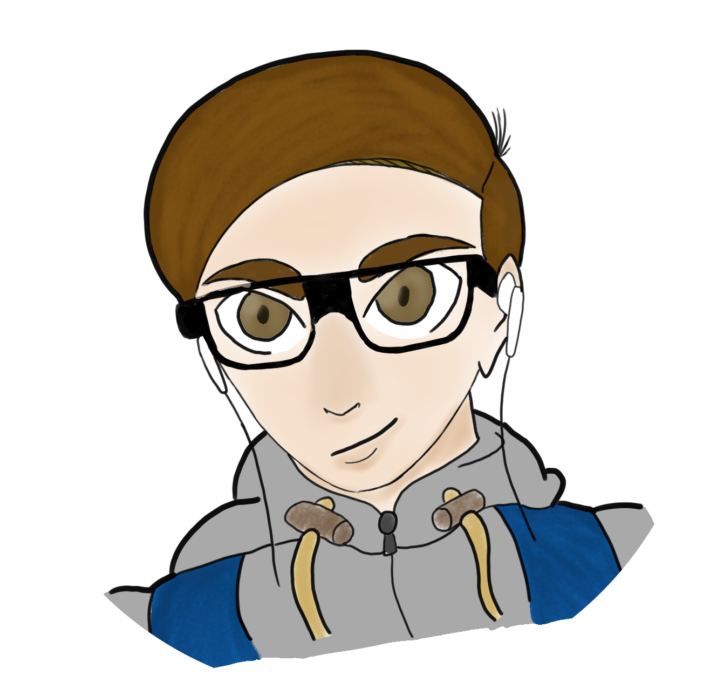

### Fabián

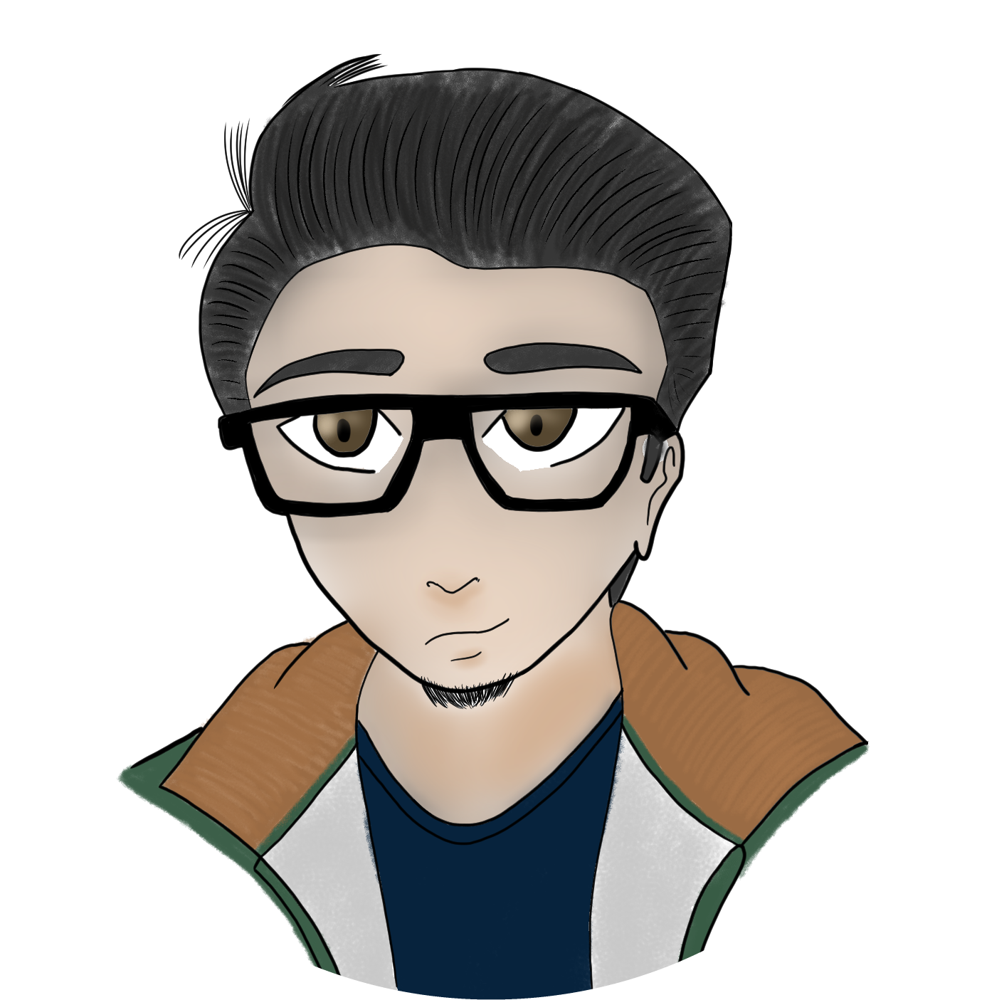

### Gustavo

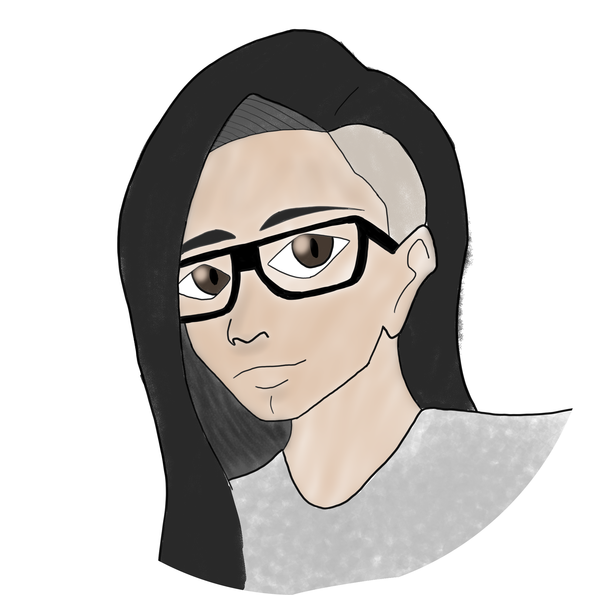

### Hasen

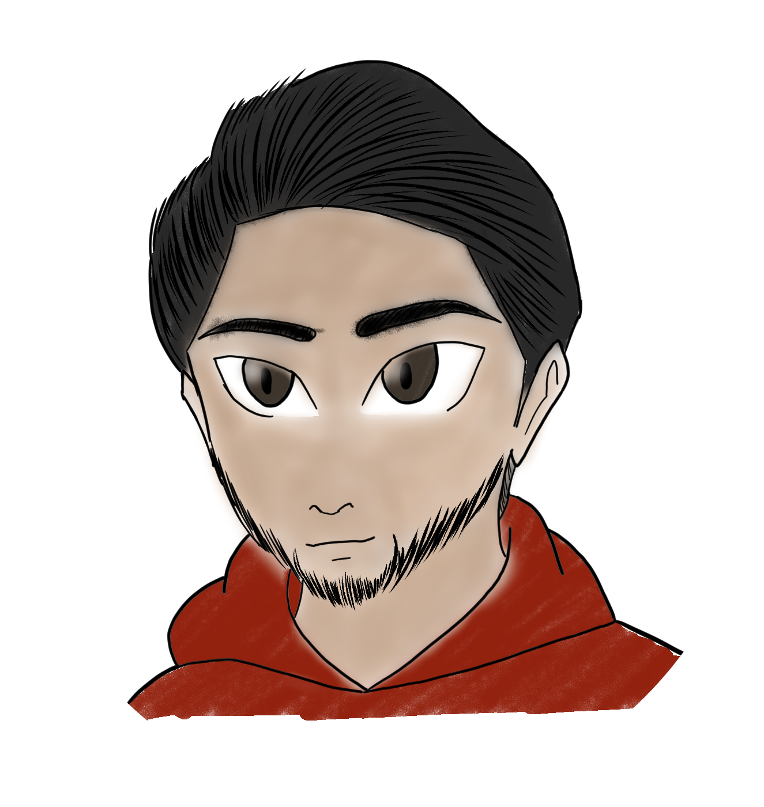

### Álvaro

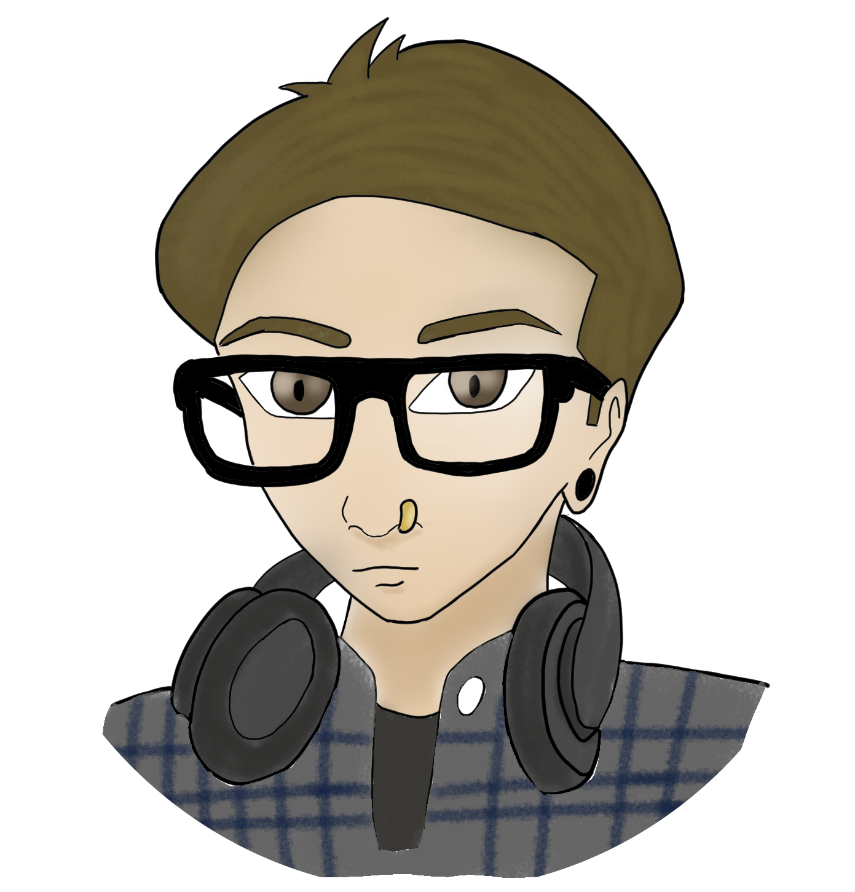

## Mockups

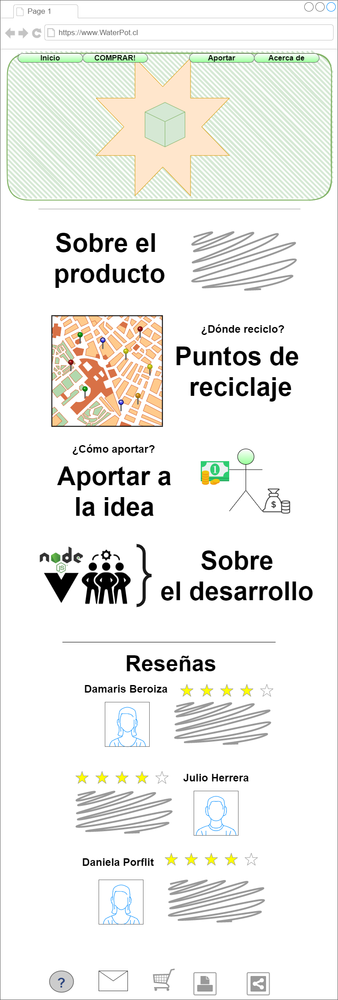


## Presentación final


- Presentación disponible como [pdf](./docs/ppt/Water-pot--Hackathon-Impacto.pdf) & [ppt](./docs/ppt/Water-pot--Hackathon-Impacto.pptx)

## Captura de imágenes del satélite SmartMet

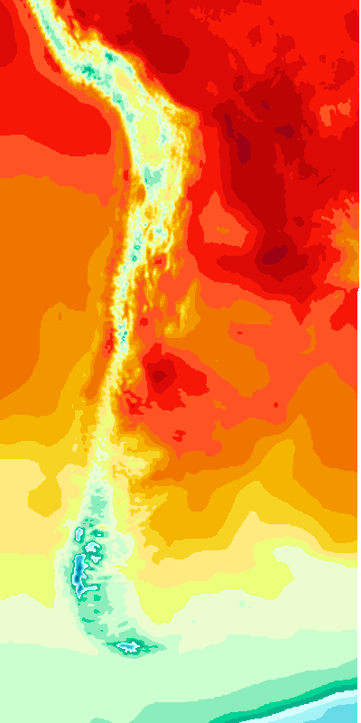

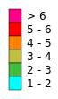

## Recursos
- Paletas de colores [coolors.co/](https://coolors.co/)
- Mockups hechos con draw.io

- [Guia_para_participantes_del_Impacto_Chile.pptx.pdf](./docs/pdf/Guia_para_participantes_del_Impacto_Chile.pptx.pdf)
- [Modelos de Negocio Las 55 cartas BMN.pdf](./docs/pdf/Modelos-de-Negocio-Las-55-cartas-BMN.pdf)
- [Pitching Trainning-4.pdf](./docs/pdf/Pitching-Trainning-4.pdf)

## Bocetos de los dibujos

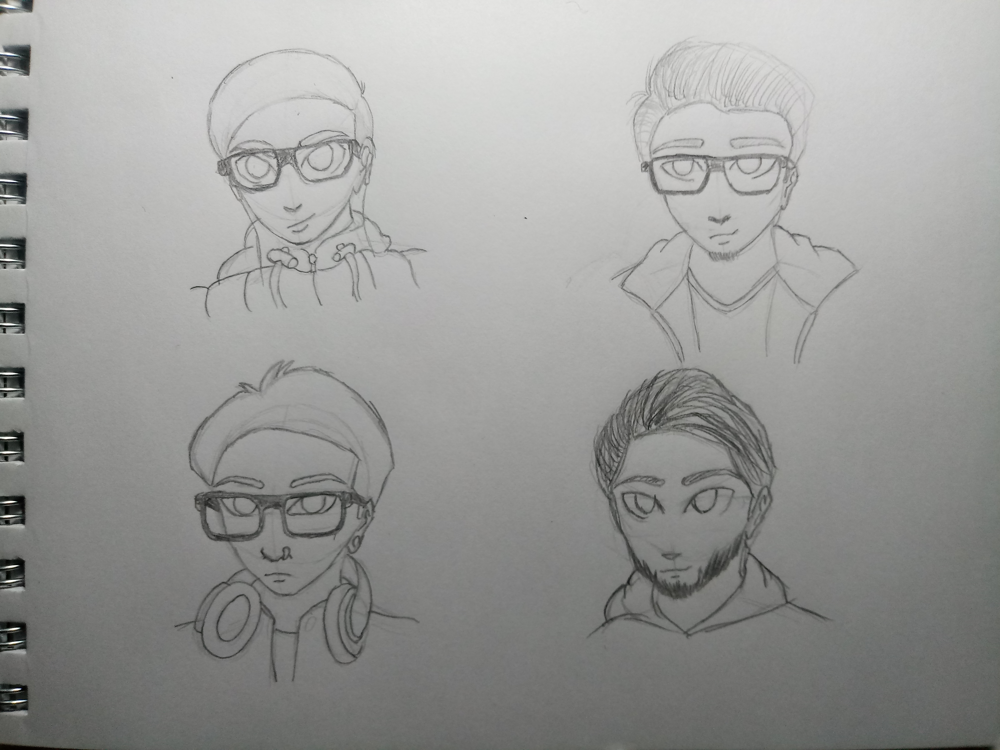

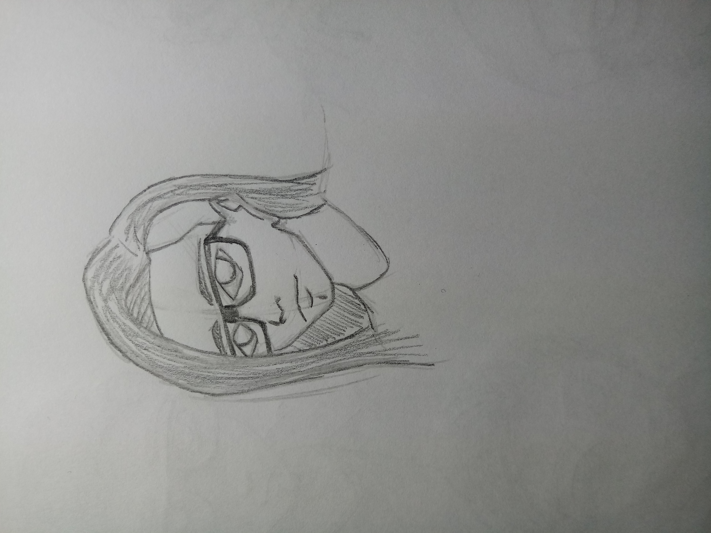

## Otras ilustraciones

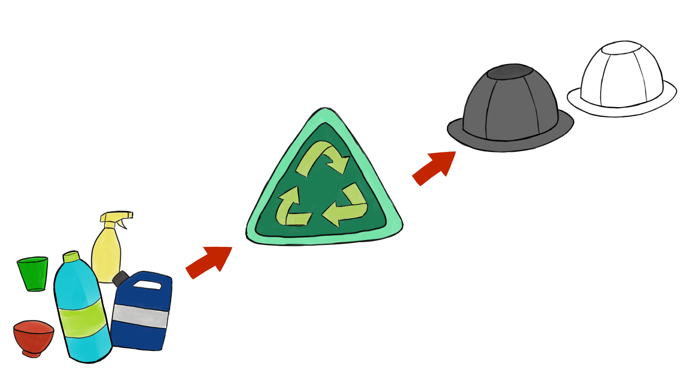

## Agradecimientos
- Embajada de finlandia
- UltraHack

- Claudio Aliaga
- Juhani Kivikangas
- Emmi Laine
- Laura Toukolehto
- Petra Autio
- Mikko Strahlendorff